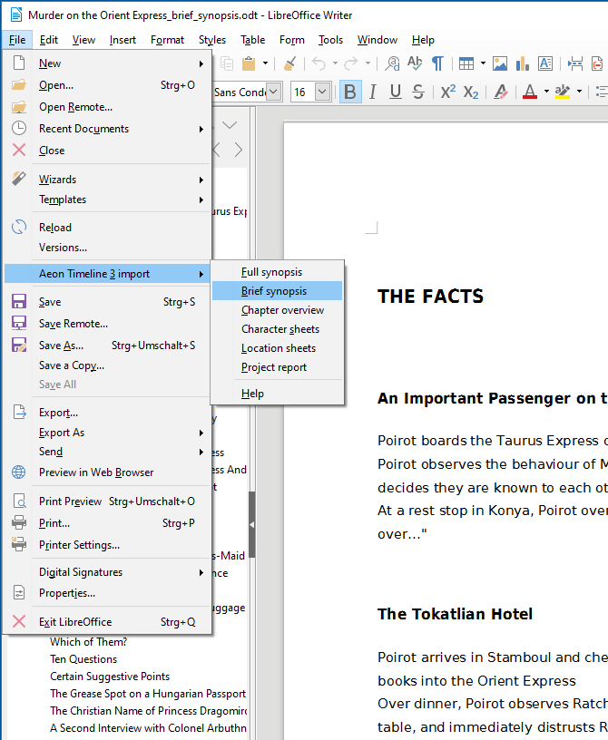

[Aeon Timeline 3](https://timeline.app/) exports its project data in a comprehensive CSV text file.
The *aeon3odt* extension for LibreOffice extracts the narrative part and generates several types 
of ODT documents.

## Features

-   Generate a **full synopsis** containing scene summaries.

-   Generate a **brief synopsis** containing scene titles.

-   Generate a **chapter overview** containing chapter titles.

-   Generate **character sheets** containing character data.

-   Generate **location sheets** containing location data.

-   Generate a **project report** containing a full description of the narrative part, the characters and the locations.

You can find more information on the [help pages](help).

## Requirements

-   [LibreOffice version 7.0+](https://www.libreoffice.org/).
-   Java Runtime Environment (LibreOffice might need it for macro
    execution).

__Please note:__  _This extension can not be installed on OpenOffice._

## Download and install {#download}

[Download the latest release (version 0.2.6)](https://raw.githubusercontent.com/peter88213/aeon3odt/master/dist/aeon3odt-L-0.2.6.oxt)

-   Installation right at download, by double-clicking on the downloaded 
    file, or via the LibreOffice Extension Manager. Instructions can be found [here](https://wiki.documentfoundation.org/Documentation/HowTo/install_extension).

-   After installation (and Office restart) you find a new "Aeon Timeline 3
    Import" submenu in the "Files" menu.

-   If no additional "Aeon Timeline 3 Import" submenu shows up in the
    "Files" menu, please look at the "Tools" > "Extensions" menu.

[Changelog](changelog)

## Credits

[OpenOffice Extension
Compiler](https://wiki.openoffice.org/wiki/Extensions_Packager#Extension_Compiler)
by Bernard Marcelly.

Frederik Lundh published the [xml pretty print algorithm](http://effbot.org/zone/element-lib.htm#prettyprint).

## License

This extension is distributed under the [MIT
License](http://www.opensource.org/licenses/mit-license.php).
